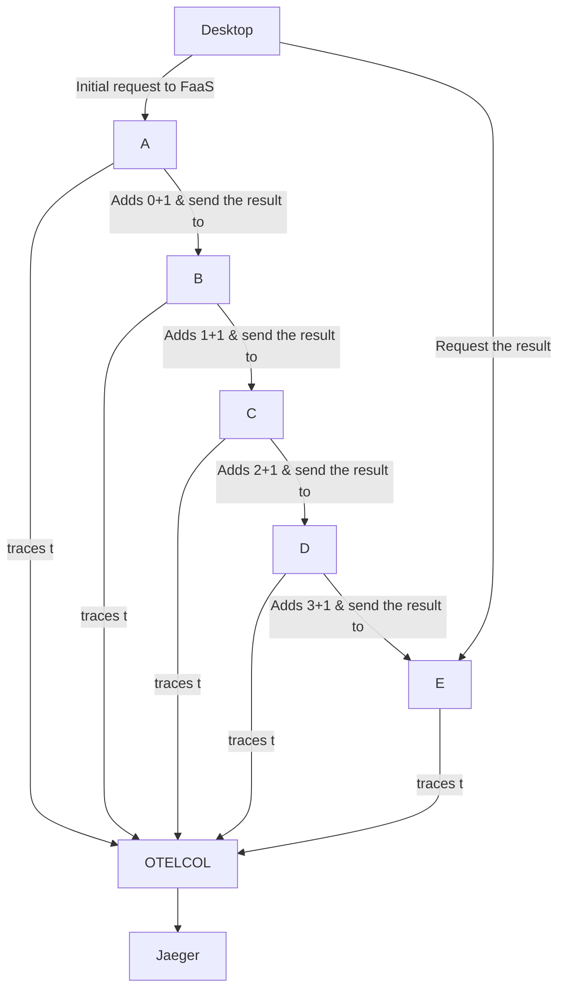

# function-five

[](https://github.com/obs-nebula/function-five/actions/workflows/ci.yml)





Run `./get-func.sh` to get the `func` command.

> Functions created with the following commands:

```
./func create -l node -t http one
./func create -l node -t http two
./func create -l node -t http three
./func create -l node -t http four
./func create -l node -t http five
```

## Run locally outside of a container

After creating the functions, the code was changed by adding the business rule, and the tests were adjusted since most of the functions in this example are only handling the POST method.

Some of the Knative function runtimes work out of the box without requiring a build, see the description [here](https://github.com/obs-nebula/function-five/issues/24#issue-1563392515).

For this, another script was added to package.json `devjs`, then we can run `npm run devjs` specifying the http port with `--port=8080` for the `faas-js-runtime`.

A basic script [./dev-js.sh](./dev-js.sh) can be executed to run the five functions.

## Run locally

### Build the functions

```
./func build --path one/   --registry your_registry_here
./func build --path two/   --registry your_registry_here
./func build --path three/ --registry your_registry_here
./func build --path four/  --registry your_registry_here
./func build --path five/  --registry your_registry_here
```

### Run 

```
docker-compose up
```

> The fantastic desktop app used in this example is here: https://github.com/obs-nebula/desktop-electron
